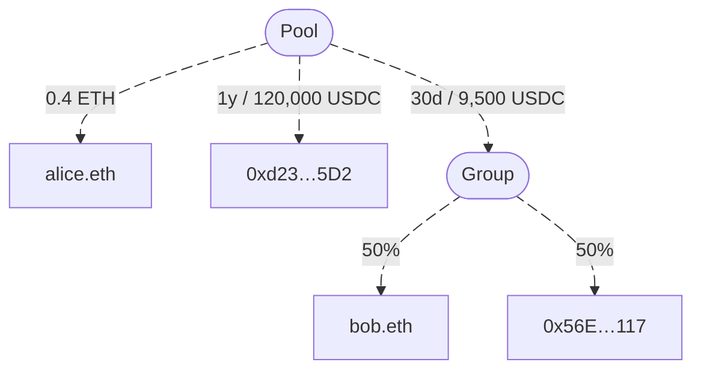

# Mutuals
Mutuals Finance is an open-source, decentralized protocol for managing on‑chain payments.
It enables automated, trustless revenue distribution, token splitting, and earnings tracking with zero protocol fees and support across 7+ networks (Ethereum, Polygon, Base, Optimism, Arbitrum, Avalanche, BNB, and zkSync).



## Apps and Packages

| App                                      | Description                             |
|------------------------------------------|-----------------------------------------|
| [`@mutuals/contracts`](./apps/contracts) | Mutuals smart contracts |
| [`@mutuals/app`](./apps/app)             | Mutuals app interface          |
| [`@mutuals/landing`](./apps/landing)     | Mutuals landing page                 |
| [`@mutuals/docs`](./apps/docs)           | Mutuals documentation                 |

| Package                                                              | Description                                |
|----------------------------------------------------------------------|--------------------------------------------|
| [`@mutuals/ui`](./packages/ui)                                       | Shared stub component and theme library    |
| [`@mutuals/graphql-client-nextjs`](./packages/graphql-client-nextjs) | Shared graphql client with graphql schemes |
| [`@mutuals/sdk`](./packages/sdk)                                     | Shared SDK                                 |
| [`@mutuals/sdk`](./packages/sdk-react)                               | Shared React SDK                           |
| [`@mutuals/eslint-config`](./packages/ui-components)                 | Shared `eslint` configurations             |
| [`@mutuals/typescript-config`](./packages/web)                       | Shared `tsconfig.json`s                    |

## Build

To build all apps and packages, run the following command:

```
cd mutuals
bun build
```

## Develop

To develop all apps and packages, run the following command:

```
cd mutuals
bun dev
```

## Remote Caching

Turborepo can use a technique known as [Remote Caching](https://turbo.build/repo/docs/core-concepts/remote-caching) to share cache artifacts across machines, enabling you to share build caches with your team and CI/CD pipelines.

By default, Turborepo will cache locally. To enable Remote Caching you will need an account with Vercel. If you don't have an account you can [create one](https://vercel.com/signup), then enter the following commands:

```
cd my-turborepo
bunx turbo login
```

This will authenticate the Turborepo CLI with your [Vercel account](https://vercel.com/docs/concepts/personal-accounts/overview).

Next, you can link your Turborepo to your Remote Cache by running the following command from the root of your Turborepo:

```
bunx turbo link
```

## Useful Links

Learn more about the power of Turborepo:

- [Tasks](https://turbo.build/repo/docs/core-concepts/monorepos/running-tasks)
- [Caching](https://turbo.build/repo/docs/core-concepts/caching)
- [Remote Caching](https://turbo.build/repo/docs/core-concepts/remote-caching)
- [Filtering](https://turbo.build/repo/docs/core-concepts/monorepos/filtering)
- [Configuration Options](https://turbo.build/repo/docs/reference/configuration)
- [CLI Usage](https://turbo.build/repo/docs/reference/command-line-reference)
