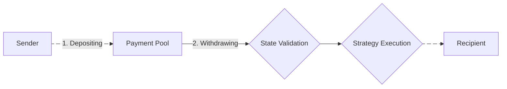

## Depositing
The Payment Pool is the single point of entry for incoming funds.
Each Payment Pool has a unique address where funds can be sent.
This address is used to deposit funds into the pool.

## Withdrawing
Assets held within a Payment Pool can be withdrawn by its designated recipients according to the allocation rules defined in the pool's structure.
When a recipient initiates a withdrawal, the Payment Pool sequentially processes the allocation tree and executes the defined smart contract functions.
For each claim in the allocation tree, two key steps are performed.
The **state validation** step checks whether the defined claim is part of the current allocation structure.
This process typically determines:
- If integrity of the claim can be asserted, meaning that the content of the claim corresponds to the intended allocation. This is determined by utilizing an on-chain reference (e.g., a hash or a mapping), which was previously stored by a trustee during the pool's setup phase.
- If the recipient of the withdrawal matches the claim's designated recipient

Next, the **strategy execution** step evaluates the specific withdrawal conditions defined in the claims of the allocation tree.
This process typically determines:
<ol>
  <li>If the requested withdrawal amount is available within the pool's balance. This is executed sequentially for each claim and remaining funds are passed to the next claim forming a cascading withdrawal mechanism</li>
  <li>If any time locks or other conditional constraints have been satisfied, allowing the withdrawal to proceed</li>
  <li>If the pool holds sufficient funds in the specified asset type to fulfill the withdrawal request</li>
</ol>

Once these determinations are made, the Payment Pool executes the withdrawal, transferring the appropriate amount of funds to the recipient's specified address.
In cases where conditions are not met (e.g., a time lock has not yet expired), the withdrawal will be denied.
