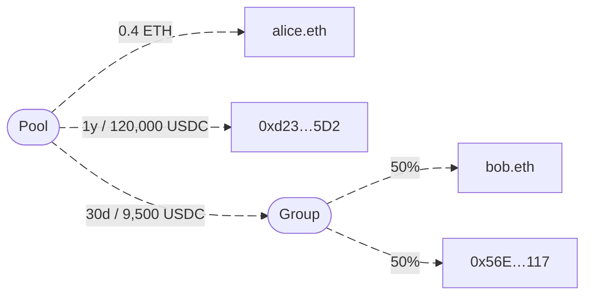

Several types of allocations are shown, including direct payments to individual addresses, time-locked allocations, and group distributions.
Recipients receive funds according to their specified shares or conditions.
Mutuals distinguishes different ways to define recipients in the allocation tree.
These include Ethereum Name Service (ENS) names, wallet addresses, phone numbers, email addresses, or groups of multiple recipients.

