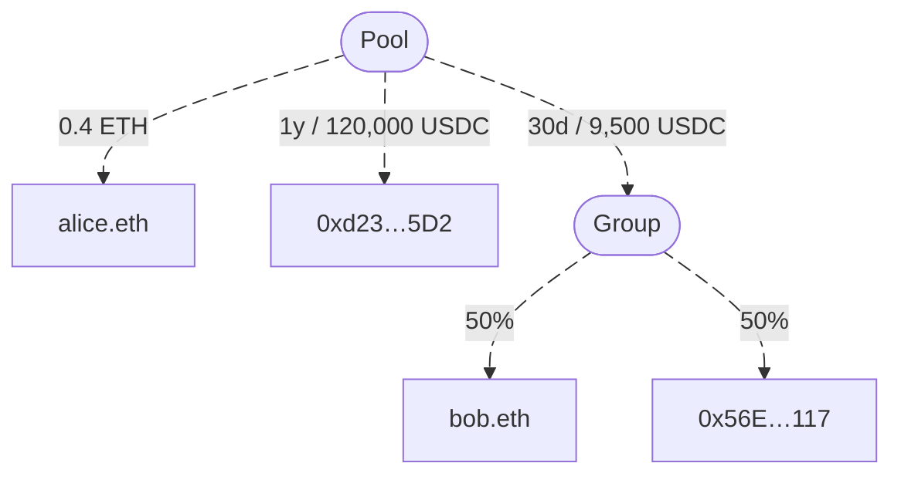

import {Callout, Cards, Image} from 'nextra/components'
import { cloneElement } from 'react'

export default function MdxLayout(props) {
  return cloneElement(props.children, {
    components: {
      img: Image
    }
  })
}

# Overview

<Callout type="warning">
  This documentation is being actively developed. Please check back regularly for updates and new content.
</Callout>

**Mutuals** is an open-source, decentralized protocol for managing on-chain payments.
Applications use it for automated revenue distribution, for example splitting payments across multiple recipients or streaming earnings to stakeholders continuously.
The decentralized nature of the system makes payment flows transparent, trustless, automated, and censorship resistant.
Mutuals consists of smart contracts deployed across multiple blockchain networks using open-source protocols.
Together, the contracts form a flexible payment infrastructure system.
The job of the protocol is to route incoming payments to all designated recipients according to predefined rules.

