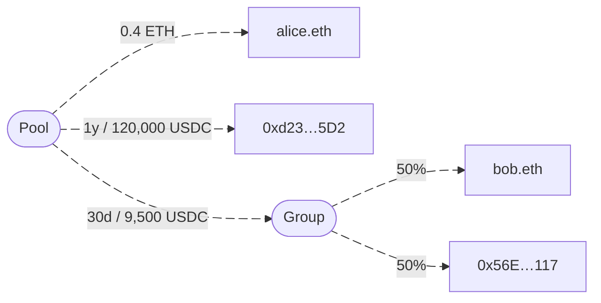

import { Alert } from '@mutuals/ui'

<Alert status="warning" title={"Work in Progress"} mb={"4"}>
  This documentation is being actively developed. Please check back regularly for updates and new content.
</Alert>

Applications use Mutuals for automated revenue distribution, for example splitting payments across multiple recipients or streaming earnings to stakeholders continuously.
The decentralized nature of the system makes payment flows transparent, trustless, automated, and censorship resistant.
Mutuals consists of smart contracts deployed across multiple blockchain networks using open-source protocols.
Together, the contracts form a flexible payment infrastructure system.
The job of the protocol is to route incoming payments to all designated recipients according to predefined rules.

## Example: A simple payment pool

This simple example shows how a payment pool routes incoming funds to various recipients.
Several types of allocations are shown, including direct payments to individual addresses, time-locked allocations, and group distributions.
Recipients receive funds according to their specified shares or conditions.
Mutuals distinguishes different ways to define recipients in the allocation tree.
These include Ethereum Name Service (ENS) names, wallet addresses, phone numbers, email addresses, or groups of multiple recipients.

