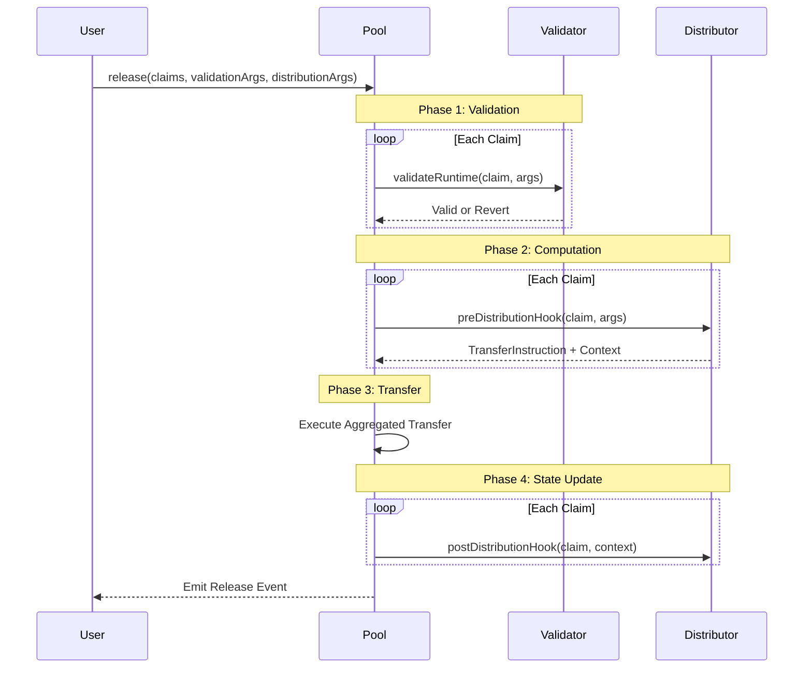

## Components

The protocol consists of three main contracts that process claims and distribute funds.

### `Pool` Contract
The `Pool` contract manages funds and orchestrates the claim execution process.
Each pool is deployed as a [UUPS upgradeable proxy](https://docs.openzeppelin.com/contracts-stylus/uups-proxy), allowing the owner to upgrade the implementation while preserving state.
The contract handles fund custody, module management, and the multi-phase execution of claims.
Pools support multiple token standards including native ETH, ERC20, ERC721, and ERC1155.
When multiple claims share the same recipient and token, the Pool automatically aggregates transfers to minimize gas costs.

### `PoolFactory` Contract
The `PoolFactory` deploys new pool instances using `CREATE2`, which generates deterministic addresses based on deployment parameters.
This enables predictable pool addresses and consistent deployment across different chains.
The factory handles both proxy deployment and pool initialization in a single transaction.

### `ModuleRegistry` Contract
The `ModuleRegistry` maintains a directory of available modules and their security attestations.
Pool owners can specify trusted attesters whose approval is required before a module can be installed.
This creates a flexible trust model where different pools can have different security requirements.

## Module System

Modules extend the protocol's functionality through two distinct interfaces.
**Validation modules** determine whether a claim is authorized.
**Distribution modules** calculate how much can be released and when.

### Validation Modules

Validation modules verify claim authenticity. The protocol includes two reference implementations:

1. **Merkle Tree Validation**: Uses off-chain computed Merkle trees to verify claims. The pool stores only a single root hash, making this approach gas-efficient for large recipient sets. Each claim requires a Merkle proof demonstrating inclusion in the tree.
2. **Onchain Mapping Validation**: Maintains an on-chain allowlist of valid claim IDs. This approach is simpler for small recipient sets where gas costs of individual storage writes are acceptable.

### Distribution Modules

Distribution modules implement release logic and track claimed amounts.
The protocol includes four reference implementations:

1. **Direct Distribution**: Supports both fixed-amount and percentage-based allocations. Percentage mode calculates allocations based on the total historical inflow to the pool, enabling dynamic revenue sharing.
2. **Vesting Distribution**: Implements linear vesting schedules. The module tracks a pool-wide start time and calculates the vested amount based on elapsed time and vesting duration.
3. **Priority Distribution**: Creates waterfall distributions where a claim can only be processed after a previous claim meets certain conditions. This enables senior/junior tranche structures.
4. **Token-Gated Distribution**: Requires recipients to hold a minimum balance of an external token before claims can be processed. This can gate distributions to governance token holders or NFT owners.

<Callout>
  The Mutuals protocol is highly flexible.
  Apart from the reference implementations, developers can create custom validation and distribution modules to implement unique claim processing logic.
</Callout>

## Claim Execution Flow

The Pool processes claims in four phases. This separation ensures proper validation before funds move, and proper state updates after successful transfers.

1. **Validation:** Checks all claims using their designated validation modules. The Pool optimizes gas by caching module lookups when consecutive claims use the same validator. If any claim fails validation, the entire transaction reverts.
2. **Computation:** calls each distribution module's pre-hook to calculate transfer amounts. Modules return transfer instructions along with context data needed for post-processing. The Pool aggregates instructions when multiple claims share the same token and recipient.
3. **Transfer:** executes token transfers. For batched claims with the same destination, a single aggregated transfer replaces multiple individual transfers, significantly reducing gas costs.
4. **State Update:** calls each distribution module's post-hook to record claimed amounts and update any internal state. Post-hooks only execute after transfers succeed, ensuring state consistency.

## Token Support

The protocol abstracts token transfers through a unified interface that handles all major token standards. Native ETH transfers use low-level calls, ERC20 transfers use optimized assembly, and ERC721/ERC1155 transfers use safe transfer methods with callback support.

The ERC20 implementation handles both standard compliant tokens and non-standard tokens that don't return boolean values. Assembly optimization reduces gas costs compared to standard Solidity transfers or SafeERC20.
